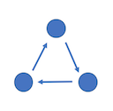
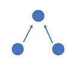

# STAT 259 – Reproducible and Collaborative Statistical Data Science

###### Dr. Fernando Perez


## 8/31/2017

#### Cylcic Graph




#### Acyclic Graph

**Directed Acyclic Graph (DAG)**

At the end of the day, git is a system of manipulating of DAGs




#### Parent Node

Naming with numbers is difficult with many simultaneous/branching nodes.

Git uses hashes to track nodes/statepoints. A **hash** is a label acting as a "digital fingerprint" to uniquely identify a commit. 

The hash is generated by a **hash function** which takes any large abstract object and reduces it to a single number. The idea being that 2 very similar objects will be assigned different numbers by the hash function.


##### Tracking node histories

Git computes the first parent node hash randomly. Subsequent nodes include a random hash *and* account for the hash of that node's parent node.

This process also lets you validate that the version of a tracked code you have matches the true version. Any change introduced in the code will propagate changes in all subsequent hashes. This makes it very easy to identify *if* a code has changed and *where* that change occurs (just trace back to where the hashes match).

#### Git

Git stores almost all of its information in a `.git` directory. Upon inspection, this directory is ~100M

* **ipython:** ~108M
* **pandas:** ~55M
* **scipy:** ~68M

Note, there are some files (images, audio, large binary data, etc.) which Git does not store well.

Git lfs is an attempt to help with storage of large files

Git uses blob storage (snapshots), not deltas (differences). Subversion–svn–uses delta storage. For long histories, it can become faster to find and return a snapshot rather than assemble all of the differences over time. To avoid huge memory consumption, Git is *incredibly* efficient at compressing data (algorithmically, but also in storing only 1 copy of things).

Git uses the [sha1](https://en.wikipedia.org/wiki/SHA-1) hash function. This takes in data, metadata, and the previous hash (optional, if the data has a parent node). Hash functions only take in raw bytes (not strings, integers, floats, etc.) and the Sha1 hash function generates hashes in hexadecimal (0-9 and a-f). 

Solving the hash functions cryptographic scheme is called finding the "collision" of the hash function.

\* Note: put `%%bash` at the start of a Jupyter notebook cell to execute in bash


## 9/12/2017

#### Reproducibility in Publication

Top journals, in general, have no standard for reproducibility

### IPython/Jupyter Notebook

Python can have interactivity; can't access shell, often requires exact syntax.

`Shift` `+` `Enter`: Run cell, move cursor to next cell  
`Ctrl` `+` `Enter`: Run cell, keep cursor on current cell  
`Alt` `+` `Enter`: Run cell, create new cell  

Jupyter notebook offers good tab completion interface  
Jupyter/IPython allow direct access to shell (precede expression with `!`)  
Magic commands allow non-shell/non-python commands (*i.e.* `%timeit`)

* `%` line magic (affects line until end)
* `%%` cell magic (affects entire cell)
* magic cells are syntax highlighted
* `%%bash` executes cell in bash
* `%%writefile` writes cell to file
* `%lsmagic` shows existing magic commands
* `%xmode` allows exception mode adjustments for error traceback display

## 9/14/2017

### Forward Compatibility

* When running in Python 2, use
 
	```
	from __future__ import print_function
	```

	This will allow you to write `print` as the newer `print()` function.
	
	Similar behavior can be triggered for other functionality. Float division (for dividing integers) is not supported by Python 2. Instead use
	
	```
	from __future__ import division
	```
* Python functions, classes, methods, etc. are objects, and so can be stored as variables.
* Variable/object names are stored separately

| Names | Objects |
|-------|---------|
|   x   |    10   |
|   y   | [1,2,3] |
|  var  | 'hello' |

* Integers are immutable types
* Lists are mutable types

<<make ppt graphics of python pointer system>>

### Python memory

#### Reference counting

Each object (stored in memory) has a reference assigned. This reference denotes how many pointers reference the object. An object is destroyed if it has a reference of zero (0 pointers reference it).

*Quirk with integers: small integers always maintain a reference (it's computationally worth keeping them around all the time). Larger integers may not, and are created as needed.

###### Angalogous to Git
`gc -prune` cuts dangling branches that do not have pointer labels associated with them.

**Note:** `numpy.dot()` can be replaced with `@` for matrix multiplication.


